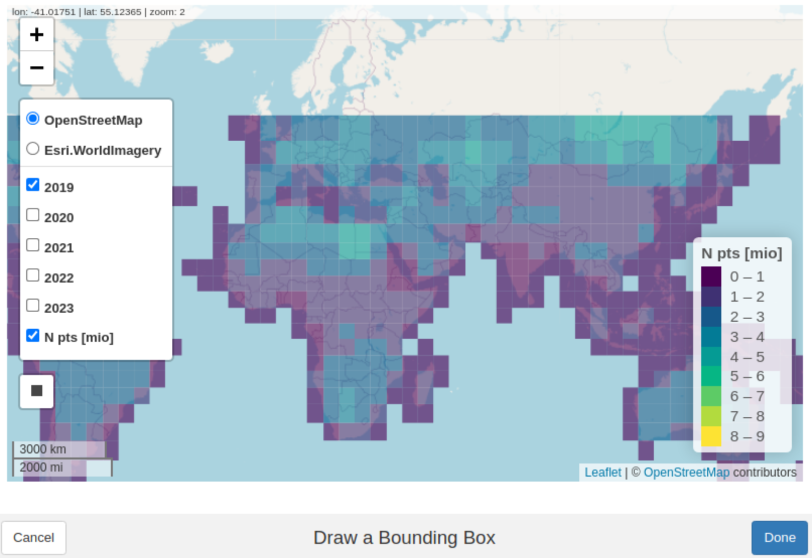

<!-- README.md is generated from README.Rmd. Please edit that file -->

```{r, include = FALSE}
knitr::opts_chunk$set(
  collapse = TRUE,
  comment = "#>",
  fig.path = "man/figures/README-",
  out.width = "100%"
)
```

# OpenEarthPoints

<!-- badges: start -->
<!-- badges: end -->

This R-package has the purpose conveniently retrieving large geospatial point data stored on the cloud. It provides tools to select, filter, and download data of interest. Currently, only GEDI data is provided, but other sources, such as ICE-Sat2 may be added in the future.

## Installation

You can install the development version of OpenEarthPoints with

```{r, eval=FALSE}
devtools::install_github("joheisig/OpenEarthPoint")
```


# Background


[GEDI](https://gedi.umd.edu/) is a full-waveform [LiDAR](https://en.wikipedia.org/wiki/Lidar) sensor with the mission of mapping biomass for global carbon dynamics research. The challenge with this data is its large volume. GEDI carries out several million measurements every day. These are processed to a table with close to 100 columns (Level 2A & 2B data), describing, e.g., elevation and canopy structure, which easily becomes larger than your computer's memory. To handle such data we use (the R bindings of) cloud-compatible software tools [Apache Arrow](https://arrow.apache.org/) and [Polars](https://docs.pola.rs/).

GEDI data is originally administered and distributed by NASA, yet not an easily accessible way. As GEDI in mounted on the ISS, it collects and stores data along its orbital flight path. However, data along a narrow line crossing all longitudes (on land and sea) is rarely useful in a spatial analysis. 


Therefore, we pre-processed and re-chunked all available data from the start of the mission in April 2019 until the end of 2023 (with frequent updates planned). The dataset is stored on a Wasabi Simple Storage Service (S3) bucket, administered by [OpenGeoHub](https://opengeohub.org/) and has ~5.4 billion observations (~1TB). It is organized as a partitioned [Parquet](https://parquet.apache.org/) dataset, which consists of one file per 5x5 degree tile and year. Parquet is a column-oriented file format with efficient storage and high compression properties.

# Setup

```{r, message=FALSE, warning=FALSE}
library(OpenEarthPoints)
library(arrow)       # to handle parquet format
library(mapview)     # interactive maps
```

# Spatial selection

The best way to select GEDI data of interest is defining a place and a time window. We can create a bounding box for spatial selection in multiple ways. A convenient one is running the code below, which opens an interactive map for drawing a bounding box by hand. To guide your selection the interactive map shows all available 5x5 degree GEDI tiles and their point counts (in millions) for each year 
The returned geometry is stored in `bb`.

```{r, eval=FALSE}
bb = draw_bbox()
```

```{r, echo=FALSE, eval=TRUE}
# if you run this notebook manually, execute the above chunk to draw your own bbox.
# otherwise, load the pre-defined bbox in this chunk.
bb = sf::st_bbox(c(xmin=-0.096983, ymin=44.189111, 
                   xmax=0.088887, ymax=44.276860),
                 crs = 4326) |> 
  sf::st_as_sfc() |> sf::st_as_sf()
```



Let's get an idea about the size of our bounding box:
```{r}
sf::st_area(bb) |> units::set_units("km^2")
```

# Create a query

## Bounding box

If we are only interested in the data enclosed by the bounding box we can pass it to our query and possibly add more selection and filter options. Here you can specify a temporal selection (`years`) or a selection of data `columns` (with options `all`, `reduced`, or a character vector with desired column names). If you want to see all available options, call `show_gedi_columns()`.

Under the hood, `bbox_query()` uses the `{polars}` library to create (a list of) optimized queries to the data on S3, which can be executed in parallel.

```{r}
q_bb = bbox_query(bb, years = 2020:2021, columns = "all")
```

A `{polars}` query may look like this:
```{r}
q_bb[[1]]$describe_optimized_plan()
```

## Tiles

In case we want to study a larger area we can consider downloading entire 5x5 degree tiles, which may be more efficient. Use `tile_query()` with the bounding box from earlier and a selection of `years` to find all intersecting tiles.

```{r}
(q_tiles = tile_query(bb, years = 2020:2021))
```

`tile_query()` returns an `sf`-object our spatio-temporal selection. It has 4 entries, covering 2 tiles for 2 years. By summing up the column `n_points` we can check how any points we are about to download: 
`sum(q_tiles$n_points)` = ```r sum(q_tiles$n_points)```

# Download

The `download_gedi()` function behaves differently depending on whether its input originates from `bbox_query()` or `tile_query()`. 

## Bounding box

Bounding box queries are executed through `{polars}`. A caveat of the current implementation is that it cannot scan all tiles of interest at, but rather sequentially sends one query per tile and year. Depending on the complexity of the query, this may generate some considerable overhead. For example, selecting a reduced number of `columns` in `bbox_query()` will lead to smaller download file, yet to an overall longer download time.

```{r, eval=1}
dir_bbox = "data/download_bbox"
download_gedi(q_bb, out.dir = dir_bbox)
```

We can now read the downloaded data from disk using `arrow::open_dataset()` and `dplyr::collect()`. 

```{r}
(data_bbox = open_dataset(dir_bbox) |> dplyr::collect())
```

## Tiles

Downloading entire tile is a little more straight forward, as we access existing parquet files without needing to query a subset of them. That means one only needs to construct URLs and run a file download, which can be run in parallel by setting `cores > 1` (currently only available on Linux systems). By the default 

```{r, eval=1}
dir_tiles = "data/download_tiles"
download_gedi(q_tiles, 
              out.dir = dir_tiles, 
              cores = 4,
              progress = T, 
              require.confirmation = F, 
              timeout = 3000)
```

Instead of `arrow::open_dataset()`, we can also use `polars::scan_parquet()` to open the retrieved files, which is more efficient for large datasets.

```{r}
library(polars)
pl$scan_parquet(paste0(dir_tiles, "/*"))$collect()
```

# Explore data

We have now successfully retrieved some GEDI data, which is almost ready to be used in an analysis. Since the whole dataset on S3 has a massive volume, some storage optimization was performed prior to upload. For example all floating point numbers were scaled and converted to integers in order to save memory. To translate our (local) data back to meaningful values we can use `rescale_gedi()`.

```{r, warning=FALSE}
data_rs = rescale_gedi(data_bbox)

head(data_bbox$cover)   # before rescaling
head(data_rs$cover)     # after rescaling 
```

Our data is now ready to go, so let's display it on a map:

```{r staticmap}
data_rs |> 
  make_sf() |> 
  dplyr::select(cover) |> 
  plot(pal = function(...) terrain.colors(..., alpha = 0.5, rev=T),
       pch = 19)
```

```{r, eval=FALSE, echo=FALSE}
data_rs |> 
  make_sf() |> 
  dplyr::select(beamname:night_flag, cover) #|> 
  mapview(zcol = "cover", alpha = 0, layer.name = "Canopy Cover [%]")
```

